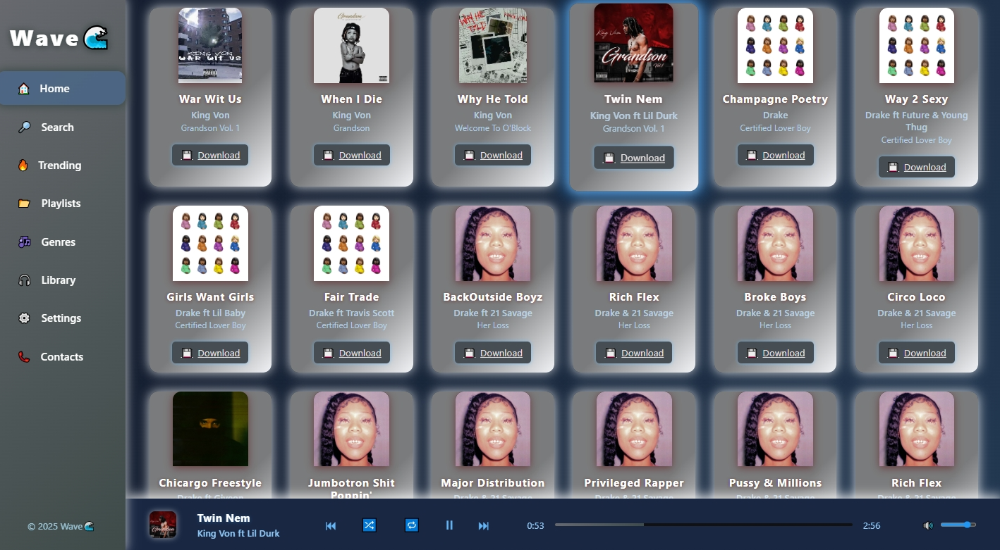

# Xyla

Let the Music Flow with the Xyla🌊

Xyla is a lightweight web-based music player built with **HTML, CSS, and JavaScript**.  
It lets you play, pause, skip, and seek songs directly from your browser. 🎶  

## 🚀 Features

- 🎵 Play/Pause songs  
- ⏭️ Next/Previous track controls  
- 📊 Progress bar with draggable seek  
- 📱 Responsive design (works on desktop & mobile)  
- ⚡ Fast, minimal, and open-source  

## 🌐 Visit the Live site

👉 [Try it here](https://gabrielbanda08.github.io/Xyla/)  

## Screenshot

## Screenshot 2

